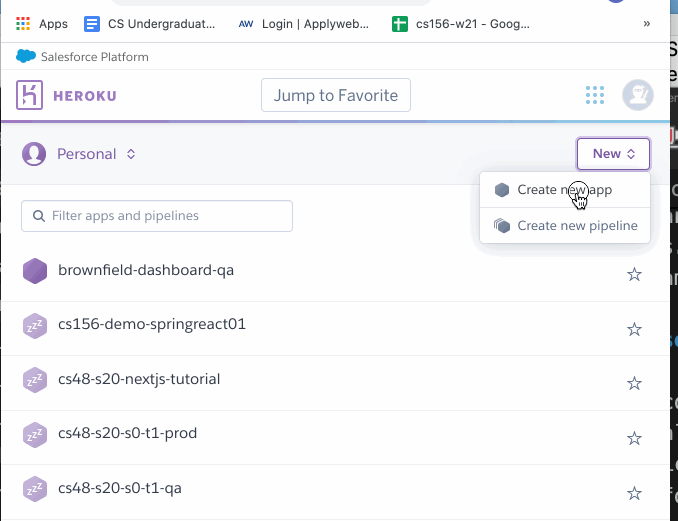
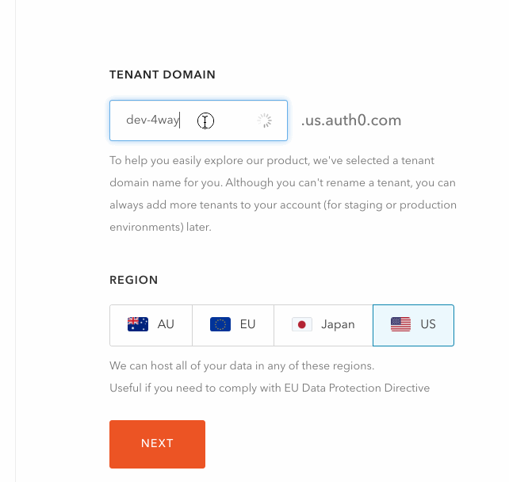
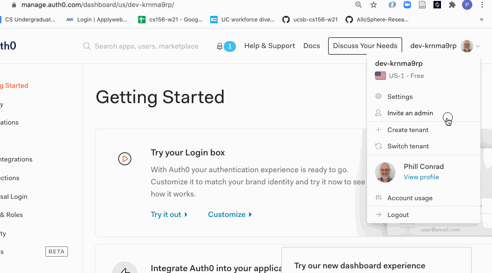
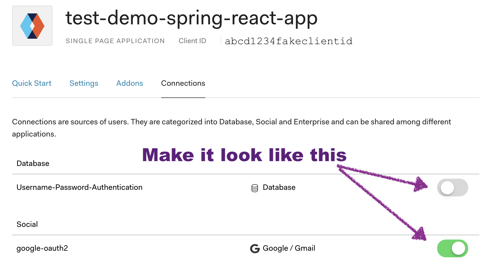
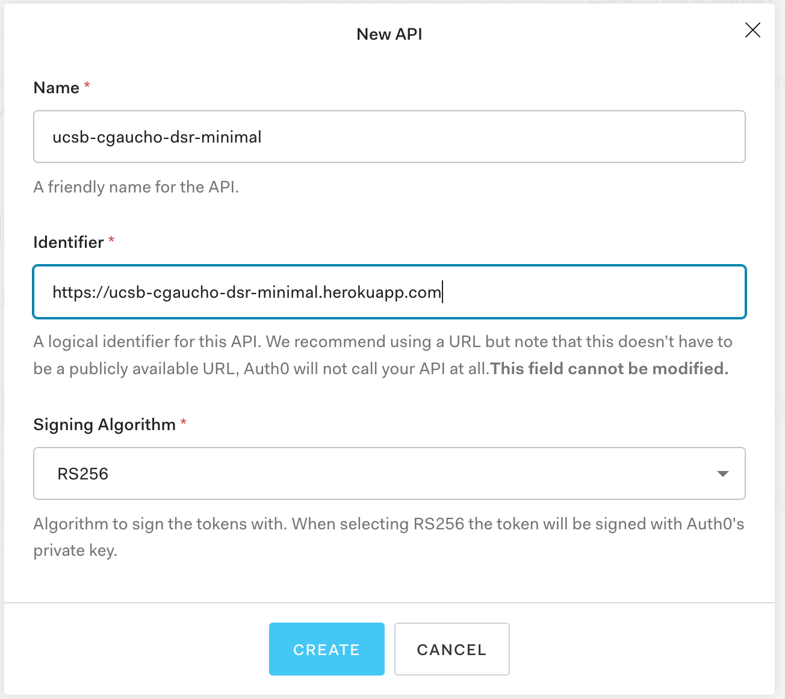
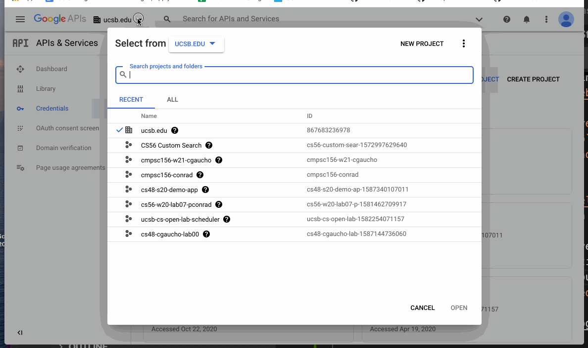
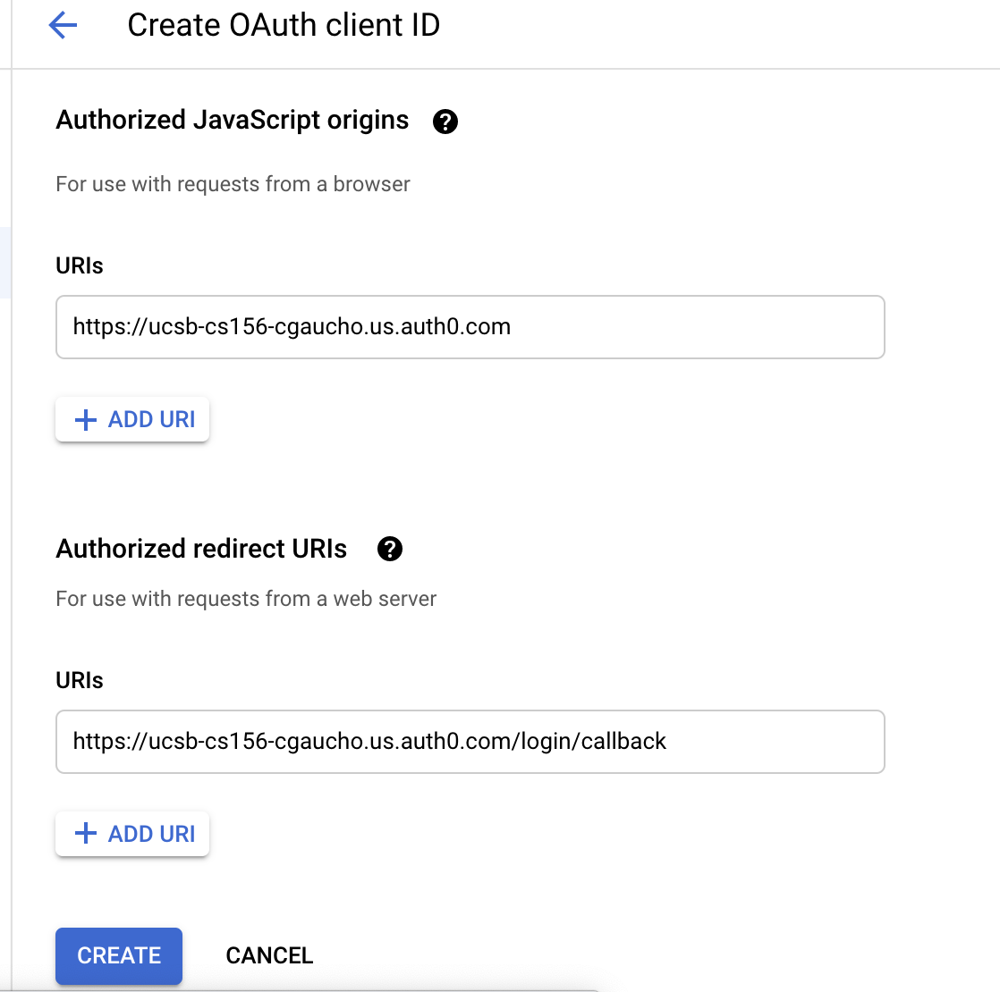
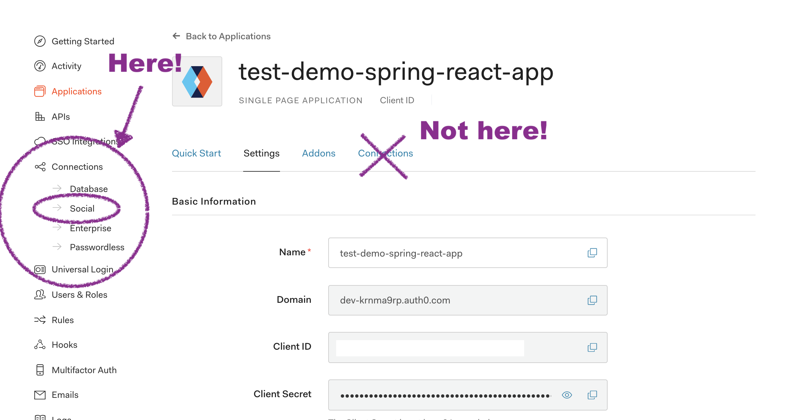

# ./docs/SETUP_FULL.md

These instructions are the full version of the setup instructions.  

If this is your first time working with setting up a Spring Boot / React application for this course, you should follow these instructions.

You may follow the [SETUP-QUICKSTART.md](./SETUP-QUICKSTART.md) version instead if:
* You've already been through the full instructions at least once
* You already have an Auth0 account with a tenant
* You already have Google Developer Project set up on your Google account

# What setup enables you to do
To get started with this application, you'll need to be able to
* Run it locally (i.e. on localhost)
* Deploy it to Heroku

These instructions cover this setup.

There are separate instructions in the file [./github-actions-secrets.md](./github-actions-secrets.md) for:

* Getting the test cases running on GitHub Actions
* Seeing aggregrated code coverage statistics on Codecov

# List of integrations

This application has integrations with the following third-party
services that require configuration
* Auth0.com (for authentication)
* Google (for authentication)
* A postgres database provisioned on Heroku
* UCSB Developer API <https://developer.ucsb.edu/>
* MongoDB Database provisioned at <https://cloud.mongodb.com/>

## Step 0: Get Organized

You are going to need to keep track of a few values that you are going
to need to copy/paste into various places.  

Therefore, we suggest that you copy and paste the following table
into a file in your editor, and fill in the values on the right hand side as we define them.  We'll call this: `temp-credentials.txt`

Example `temp-credentials.txt`
```
heroku.app:
heroku.url:
auth0.tenant:
auth0.domain:
auth0.clientId: 
google.clientId:
google.clientSecret:
```

Note that some of these values, if they leak into public GitHub repos, 
could be used to compromise the integrity of your account, Some of these values
are things that you *should not commit into a GitHub repo*, and should
not be put into a file that you save inside your repo.  Make this a 
temporary file that you have open just while working on the app.

We have put the name `temp-credentials.txt` into the `.gitignore` of this
repo to avoid a scenario where you accidentally commit this file to the
repo.

Note that the file `temp-credentials.txt` in this instructions is for
helping you keep track of things only, and *has no effect* on your 
actual application.   

## Step 1: Choose an application name.

We ask you to choose a heroku app name even before getting started
with configuring the app localhost, because then we can do the
set up on Auth0 and Google just once, instead of having to revisit
it multiple times.   Therefore, the first step is to choose
a Heroku application name.   

You should do this even if you plan, right now, only to get the application running on localhost.

Login to Heroku.com and choose an application name. 

To avoid name collisions with other students,
we suggest that your application name be `project-name-ucsbnetid` where
* `project-name` is either the name of the course assignment, the name of the repo, or if needed, an abbreviated name of the repo
* `ucsbnetid` is your UCSBNetId, i.e. the part of your `@ucsb.edu` email address that comes before `@ucsb.edu`

There is a limit of 30 characters on application names
in Heroku, so if necessary, abbreviate parts of your
app name:

Examples:
* `jpa03-cgaucho`
* `ucsb-courses-search-cgaucho`
* `demo-spring-react-min-cgaucho`
* `dsr-min-cgaucho`


Make the following adjustments to your `ucsbnetid`:
* upper case letters become lowercase (e.g `Gaucho4Life` becomes `gaucho4life`)
* underscores become hyphens (e.g. `Del_Playa` becomes `del-playa`)
* dots become hyphens (`Chris.Gaucho` becomes `chris-gaucho`)


Enter your app name into Heroku.com to create a new application as shown below.  

If your app name is, for example, `dsr-min-cgaucho`, then the eventual URL of this application is now, for example `https://dsr-min-cgaucho.herokuapp.com`



Then enter this name for the value `heroku.app` in your `temp-credentials.txt`, and enter the full url for `heroku.url`
so that the file looks something like this:

```
heroku.app: dsr-min-cgaucho
heroku.url: https://dsr-min-cgaucho.herokuapp.com
auth0.tenant: 
auth0.domain:
auth0.clientId: 
```

## Step 2: Create an Auth0.com Account and/or Tenant

Creating an Auth0 account is a one-time setup step for the entire course.

Auth0.com is a third-party service that developers manage authentication
in their apps.  We'll be using that in this course.

To set up Auth0, visit <https://auth0.com> and sign in using Google Authentication, and your UCSB email address.    
* Why my UCSB email address?  Because when we manage shared applications
  later in the quarter, it will be much easier if we are all using a
  consistent, predictable account.   The staff and your fellow team members
  can look you up by your UCSB email address, while if you use something
  else, that's a lot harder to do, which makes configuring shared access
  a lot harder to manage.

If you are new to Auth0, you should then be asked to create your first _tenant_.    Setting up a new Auth0 tenant is typically done just once per course
for your individual work, and then possibly later for work you do in your team.

A default name for your new _tenant_ is shown, something like `dev-krn9map` (yours will be different.)  We are doing to suggest changing that name as explained below; but first let's understand what a _tenant_ is in Auth0.

A _tenant_ in Auth0 is simply a group of related applications.  For example, you can create
separate _tenants_ for:
* all the individual work you do in your Auth0 account for this course
* all the work your team does as a team
* work you might do on a separate personal project for a Hackathon

Each of these _tenants_ can be managed separately, and access to them can be
shared (or not) separately from one another.

Please call your first tenant: `ucsb-cs156-cgaucho` where `cgaucho` is your ucsb email address (modified in the same way as we do for Heroku app names, i.e. all lowercase, and dots/underscore replaced with hyphens).

Here's what that looks like: 



If  already have an Auth0 account, or went past this step without giving your
first tenant this name, no problem.  You can create a new tenant as shown below, and give
it the correct name (Note that it is [*not possible* to "rename a tenant" in Auth0](https://community.auth0.com/t/any-way-to-change-a-tenant-name/44193)).



As you can see it is possible to switch tenants at any time using the menu 
options at the upper right hand corner of the Auth0.com website.

You will need the name of your tenant (e.g. `ucsb-cs156-cgaucho`) for 
subsequent steps, so let's put that in our `temp-credentials.txt` file
as the value for `auth0.tenant`.

If you've been following up to this point, you should have value
like this in your `temp-credentials.txt`:

```
heroku.app: dsr-min-cgaucho
heroku.url: https://dsr-min-cgaucho.herokuapp.com
auth0.tenant: ucsb-cs156-cgaucho
auth0.domain:
auth0.clientId: 
google.clientId:
google.clientSecret:
app.ucsb.api.consumer_key:
spring.data.mongodb.uri:
```

## Step 3: Set up new Auth0 application

The next step is to set up a new Auth0 application.  While logged in to Auth0.com, with the correct tenant selected, navigating to the "Applications" page in the sidebar and clicking the
"Create Application" button. 

Name your application that same thing as you named your heroku application
(e.g. when you put in a name, make it the same name as what you put
in for `heroku.app` in your `temp-credentials.txt`.

Select "Single Page Application" as the application type, and click "Create".

You'll be shown a screen under the "Quick Start" tab where it asks you to
select what technology you are using. *You may skip this step*.

Instead, in the configuration for the application you just created, click on the "Settings" tab and scroll down to the section with the heading `Application URIs`, and fill in the following values
in the appropriate fields.  

_Errors at this step are responsible for most of the problems students
run into, so do this step carefully_.

Note the following:
* The URL values that include the word `localhost` start with `http`, while the ones that contain `herokuapp` start with `https`. 
* The value `ucsb-cgaucho-dsr-minimal` should be replaced in EVERY case with the actual value you used for   `heroku_app_name` in your `temp-credentials.txt`; it should not literally be `ucsb-cgaucho-dsr-minimal`.
* It is important to copy these values accurately; any small typo here can result into errors that are very annoying to debug.  So do this step _carefully_.


| Field                 | Value                                        |
| --------------------- | -------------------------------------------- |
| Allowed Callback URLs | http://localhost:3000, http://localhost:8080, https://dsr-min-cgaucho.herokuapp.com |
| Allowed Logout URLs   | http://localhost:3000, http://localhost:8080, https://dsr-min-cgaucho.herokuapp.com |
| Allowed Web Origins   | http://localhost:3000, http://localhost:8080, https://dsr-min-cgaucho.herokuapp.com |


Make sure to scroll down and click "Save Changes" at the bottom of the page.

Now, in the "Connections" tab of **your app** (not from the sidebar)

- Uncheck Username-Password-Authentication.
- Ensure `google-oauth2` is checked (it should be by default).
  See image below for an example of what it should look like.



Next, go back to the Settings tab of your app (the same tab where you entered the callback URIs).   

At this point, you should be able to find the value for for `Domain` and `Client ID`, and use these to fill in the values for
`auth0.domain` and `auth0.clientId` in your  `temp-credentials.txt` file.  


* The value of the `Domain` field should be something like  `ucsb-cs156-cgaucho.us.auth0.com`, where `ucsb-cs156-cgaucho` is the name of your Auth0 tenant.     
  - Copy this value into your `temp-credentials.txt` file as the value for `auth0.domain`.  
* The value of the `Client ID` field should be a alphanumeric string, something like: `6KoPsWMM2A27PjAejHHWTXApra8CVQ6C`.  
- Copy this value into your `temp-credentials.txt` file as the value for `auth0.clientid`. 

Your `temp-credentials.txt` file should now look something like this:

```
heroku.app: dsr-min-cgaucho
heroku.url: https://dsr-min-cgaucho.herokuapp.com
auth0.tenant: ucsb-cs156-cgaucho
auth0.domain: ucsb-cs156-cgaucho.us.auth0.com
auth0.clientid: 6KoPsWMM2A27PjAejHHWTXApra8CVQ6C
google.clientId:
google.clientSecret: 
app.ucsb.api.consumer_key:
spring.data.mongodb.uri:
```

## Step 4: Set up an API under Auth0

The next step is to create an API under Auth0.  To do this, 
go to the sidebar in Auth0, and locate the `APIs` tab.

You should see (at least) one API listed, namely the `Auth0 Management API`. This API is used to manage all other APIs, so we'll create an API that is specific to just our application.

First, click on the `Create API` button.

Next, fill in the fields as follows:
| Field name | Value | Description |
|------------|-------|-------------|
| Name | The name of your application | This is just a visual name for the Auth0 API of your application, and in principle it could be anything.  But to help keep things organized, we'll use the same value that we used for the `heroku.app`,   Example `dsr-min-cgaucho`|
| Identifier | Copy your full heroku url into this field; e.g. `https://dsr-min-cgaucho.herokuapp.com` | This will end up serving as the "audience" value, the "key" that identifies custom claims in the JWT token. |
| Signing algorithm | RS256 | This determines what cryptographic algorithm is used to verify tokens. The standard is RS256, so we use that here |

It should end up looking like the below image (with your application name):




Hit `Create` to create your API.

## Step 5: Set up new Google OAuth Application (once per Auth0 tentant)

(NOTE: This step only has to be done *once per Auth0 tenant*, not once per
application.  So if this is the first application you are setting up
for this Auth0 tenant, you need to do this step in full.

Otherwise, you can simply reuse the credentials from the Google OAuth Application you already set up for this Auth0 tenant.  It is for this reason
that we recommend naming the Application the same thing as your Auth0 tenant.)

Because UCSB uses Google Gmail as an email provider for all students, staff and faculty, we can depend on the fact that every member of the UCSB community has the ability to authenticate through Google.  For that reason, we use Google Authentication via a protocol called "OAuth" in many appllications we develop in this course.

To get started with Google Authentication, you need to login with a Google Account; for a variety of reasons, we suggest that you use your UCSB Google Account for this purpose.  

* Here's why: the course staff are in a better position to help you troubleshoot when we are able to look up your
username--which we can do with your UCSB username.

The instructions below are based on the instructions <a href="https://developers.google.com/identity/sign-in/web/sign-in" target="_blank">here</a>.

You'll need the values from your `temp-credentials.txt` file for:
* `heroku.app` (e.g. `dsr-min-cgaucho`)
* `auth0.tenant` (e.g.`ucsb-cs156-cgaucho`) 
* `auth0.domain` (e.g. `ucsb-cs156-cgaucho.us.auth0.com`)
so, have those handy.

1. Navigate to page <a href="https://developers.google.com/identity/sign-in/web/sign-in" target="_blank">Google OAuth Instructions</a> and click where it says "Go to the Credentials Page".
2. When you land on this page, if you haven't already done so, 
   click as shown in the following animation to
   create a new project.   Please call your project `cmpsc156-yourUCSBNetID`, and for the "location", select `ucsb.edu`, then `UnPaid`, as shown here:

     

   Or, if you already have a `cmpsc156-yourUCSBNetID` project, select that
   project.
2. Click `Create credentials > OAuth client ID.`
3. For the `User Type`, click `Internal` then click `Create`
4. For the `App Name`, enter your the value you chose for `heroku.app`, e.g. `dsr-min-cgaucho` 
5. For the `User Support Email` and `Developer Contact Info` put in your own `@ucsb.edu` email address. You can leave the other fields with their default values.
6. There is a button to "Add or Remove Scopes".  Please click the buttons beside `auth/userinfo/email` and `auth/userinfo/profile`, then click `Update`
7. Return to the screen where you can click to  `Create credentials > OAuth client ID.`
8. You should now be asked to select an application type; choose `Web application`
9. Name your OAuth 2.0 client using the same name as your `auth0.tenant` (e.g. `ucsb-cs156-cgaucho`).   Since you only need one client per Auth0 tenant, it makes sense to give these the same name.
10. Add an authorized JavaScript origin with the value `https://insert-your-auth0-domain-here`, substituting in the value of `auth0.domain` prefixed with `https://`, e.g. `https://ucsb-cs156-cgaucho.us.auth0.com`
11. Add an authorized redirect URI, with the value `https://insert-your-auth0-domain-here/login/callback`, substituting in the value of `auth0.domain` prefixed with `https://`, and suffixed with `/login/callback/` e.g. `https://ucsb-cs156-cgaucho.us.auth0.com/login/callback` 
   It should look something like this:
   
12. Scroll down and click "Create" to create your Google OAuth App.
13. You should see a pop-up with a "Client ID" and "Client Secret". Copy these values into your  `temp-credentials.txt` as the values of 
`google.clientId` and `google.clientSecret`.  You'll need these in a later step.

## Step 6: Set up new Auth0 Social Login Connection (once per Auth0 tentant)

Now, return to the browser tab open to your Auth0 application.

- One point to clear up: There are two client id and client secret pairs floating around here; one for the Auth0 application, and another for the Google API.  Don't be confused. Right now, we are working with the Google client id and client secret.
- Navigate to the "Connections -> Social" page in the sidebar of the Auth0.com web interface, as shown in the image below.
- Click on "Google" and fill in the "Client ID" and "Client Secret" from the values of `google.clientId` and `google.clientSecret` that you put into your  `temp-credentials.txt` file in the previous step.
- Make sure to scroll down and click "Save Changes" at the bottom of the dialog to save your changes.

When you have completed this step, you may return to the main instructions in the [../README.md](../README.md) to continue.



## Step 7: Setting up Custom Claims in Auth0

**Introduction**

JWT User Access Tokens are base-64 encoded JSON objects: within these json objects there are some keys and fields that are expected to be there. 

If you want to add additional keys and values, these are called _custom claims_.  We can provide Auth0 with some JavaScript code that will insert custom values into the JWT token provided to our application for authentication.

The keys for custom claims must begin with a unique value. This makes sure that claims from one application don't interfere with claims from another application.  For our key, we are using the name of our Heroku app; this is the "audience" value for our custom claim.


The specific "custom claims" we need for our application are
* email
* first name (given name)
* last name (family name)

These are values we can get from the authentication provider (i.e. from Google, via Auth0), and then access in our application.

If your application is mostly working properly, but does not load a user's _role_ properly,  this is often a symptom that the following step was not done properly.

**Instructions**

In Auth0.com go to the left hand sidebar and click `Rules`, then click `Create Rule`. Select `Empty Rule` at the top.

There is a function that takes a user, a context, and a callback. Context has an access token as a property. User has all of the user information. We want to add a property to `context.accessToken`.

To do this, add the following code, _being sure to change_ where it says `""https://dsr-min-cgaucho.herokuapp.com""`, replacing that with your value for the name
of your heroku app (the value of `heroku.url` in your `temp-credentials.txt` file).   If this does not match the values that you fill in later
for `REACT_APP_AUTH0_AUDIENCE` (which we should also be the value of `heroku.app` in your `temp-credentials.txt` file) then things will not work properly.

Insert this code into the template for the custom claim, replacing the
line that says: `// TODO: implement your rule`

```javascript
context.accessToken["https://dsr-min-cgaucho.herokuapp.com"]={
  "email" : user.email,
  "given_name" : user.given_name,
  "family_name" : user.family_name
};
```

The whole thing should look something like this when you are done:

```javascript
function (user, context, callback) {
   context.accessToken["https://dsr-min-cgaucho.herokuapp.com"]={
    "email" : user.email,
    "given_name" : user.given_name,
    "family_name" : user.family_name
  };
  return callback(null, user, context);
}
```

## Step 8: Custom configuration for this app

Steps 1-7 and Step 9 are generally the same for all applications in this course.   
Step 8 is where we put special configuration that is particular this this application.


## Step 8a: MongoDB Database credentials

See the top level README.md for details about how to set the value of `spring.data.mongodb.uri:` in `temp-credentials.txt`


## Step 9: Set up the secrets files

There are now three files that you have to configure in your app&mdash;two for the frontend, and two for backend.  

| Filename | Layer | Purpose |
|-|-|-|
| `./secrets-localhost.properties` | backend (Java, Spring) | Sets properties used by the backend Java code when running on localhost | 
| `./secrets-heroku.properties` | backend (Java, Spring) | Used as a source for copying properties to the Heroku backend config var `SPRING_PROPERTIES` by the python script `setHerokuVars.py` (more detail below)|
| `./javascript/.env.local` | frontend (JavaScript, React) | Used by the frontend JavaScript code to set properties |

Some of the values in each of these files are considered  _secrets_, i.e. token values that similar to passwords.   These values can be used to compromise the security of your system; accordingly they should
* not be hardcoded in Java or JavaScript source code
* not be stored in files in your GitHub repo (since many of our repos are open source.)

Accordingly, in the repo, you will only find `.SAMPLE` versions of these file:

| Sample filename | Actual filename |
|-|-|
| `secrets-localhost.properties.SAMPLE` | `secrets-localhost.properties` |
| `secrets-heroku.properties.SAMPLE` | `secrets-heroku.properties` |
| `javascript/.env.local.SAMPLE` | `javascript/.env.local` |

In each case, you will need to copy from the `.SAMPLE` version of the file
to the actual filename, and then edit the file to put in the correct values.

We'll do this first for the files needed to run on localhost, and then
on the files needed for Heroku.

### Step 9a: Set up the secrets files for localhost

For localhost, copy from the `.SAMPLE` files to the actual files
needed for the application.  From the root of the repo:

```
cp secrets-localhost.properties.SAMPLE secrets-localhost.properties
cp javascript/.env.local.SAMPLE javascript/.env.local
```

Now, you will edit the `secrets-localhost.properties` file with your
preferred text editor, and fill in the values as shown below:

| Key | Example value | Explanation | Copy from corresponding value in `temp-credentials.txt` for |
|-----|---------------|-------------|---|
| `app.namespace` | `https://dsr-min-cgaucho.herokuapp.com` | The name you gave to your app on Heroku |  `heroku.url` |
| `app.admin.emails` | `phtcon@ucsb.edu,youremail@ucsb.edu` | A comma separated list of emails for admins for the app.  Add your email. |  (none) |
| `auth0.domain` | `ucsb-cs156-cgaucho.us.auth0.com` | The DNS hostname used to access Auth0 services; starts wtih the name of your tenant, and ends with something like `.us.auth0.com` |  `auth0.domain` |
| `auth0.clientId` | `6KoPsWMM2A27PjAejHHWTXApra8CVQ6C` | The value that identifies the specific Auth0 application from your tenant |  `auth0.clientId` |
| `app.ucsb.api.consumer_key` | | Key for UCSB Developer API| `app.ucsb.api.consumer_key` |
| `spring.data.mongodb.uri` | | URI for accessing MongoDB data | `spring.data.mongodb.uri` |
| `security.oauth2.resource.id` | `https://dsr-min-cgaucho.herokuapp.com` | Copy the same value as `app.namespace`  |  `heroku.url` |
|`security.oauth2.resource.jwk.keySetUri`| (no change)| Leave unchanged from value in `.SAMPLE` file | | 

Next, you will edit the `javascript/.env.local` file with your
preferred text editor, and fill in the values as shown below:

| Key | Example value | Explanation | Copy from corresponding value in `temp-credentials.txt` for |
|-----|---------------|-------------|---|
|`REACT_APP_AUTH0_DOMAIN`| `ucsb-cs156-cgaucho.us.auth0.com` | The DNS hostname used to access Auth0 services; starts wtih the name of your tenant, and ends with something like `.us.auth0.com` |  `auth0.domain` |
|`REACT_APP_AUTH0_CLIENT_ID`| `6KoPsWMM2A27PjAejHHWTXApra8CVQ6C`| The value that identifies the specific Auth0 application from your tenant |  `auth0.clientId` |
|`REACT_APP_AUTH0_AUDIENCE`| `https://dsr-min-cgaucho.herokuapp.com` | The name you gave to your app on Heroku (used here to identify which Auth0 API we are using)`heroku.url` |

At this point, you should be able to run the app on localhost with the command:

```bash
mvn spring-boot:run
```

### Step 9b: Set up the secrets files for Heroku

For Heroku, copy from the `.SAMPLE` file the backend file to the
actual file:

```
cp secrets-heroku.properties.SAMPLE secrets-heroku.properties
```

We'll update that file in a moment.

First, let's note that while some repos set up for this course might have a file `javascript/.env.production.SAMPLE`, it is actually not necessary to have a separate `.env.production` file.  For the frontend code, if you have a `.env.local` file defined, and if the values that will be used on Heroku are the same as those used on localhost, it is not necessary to have a separate `.env.production` file.  The details are explained here: <https://create-react-app.dev/docs/adding-custom-environment-variables/)>.

Now, let us return to updating the values in the secrets-heroku.properties file.

First, all of the following variables should be set up *exactly* as they are in the `secrets-localhost.properties` file.  So it's best to just copy/paste this entire section:

```
app.namespace
app.admin.emails
auth0.domain
auth0.clientId
app.ucsb.api.consumer_key
spring.data.mongodb.uri
security.oauth2.resource.id
security.oauth2.resource.jwk.keySetUri
```

The remainder of the values should typically be unmodified.  That includes
all of the following:

```
spring.jpa.database-platform=org.hibernate.dialect.PostgreSQLDialect
spring.datasource.driver-class-name = org.postgresql.Driver
spring.jpa.properties.hibernate.temp.use_jdbc_metadata_defaults=false

spring.datasource.url=${JDBC_DATABASE_URL}
spring.datasource.username=${JDBC_DATABASE_USERNAME}
spring.datasource.password=${JDBC_DATABASE_PASSWORD}
spring.jpa.hibernate.ddl-auto=update
```

Now, it is important to note that when running on Heroku, the backend
gets its properties values from the Heroku config variable `SPRING_PROPERTIES`, _not_ directly from the `secrets-heroku.properties` file.   

The purpose of the `secrets-heroku.properties` is to initialize the values of the Heroku Config variable `SPRING_PROPERTIES` via the Python script `./setHerokuVars.py`.

Therefore, once the file `secrets-heroku.properties` is properly configured, the next step is to login to the Heroku CLI.  
* If you are on CSIL, use `heroku login -i`
* If you are working on your own machine, installation instructions are here:
  <https://devcenter.heroku.com/articles/heroku-cli>.  You should then be able to do `heroku login` or `heroku login -i` to login.

Once you are logged into the Heroku CLI, you should be able to run the script to set the variables to the values from your `secrets-heroku.properties` file using the script `./setHerokuVars.py`, as shown below.  You will need to specify the name of your own Heroku app; the value `ucsb-cs156-dsr-minimal` is just an example.  This is the value of `heroku.app` from your `temp-credentials.txt` file:


```bash
   python3 setHerokuVars.py ucsb-cs156-dsr-minimal
```

Note that the first line of this command might be `python3` or simply
`python`, depending on your particular operating system and installation
of Python. If you are not sure, use `python -v` or `python3 -v` to see
which command gives you some version of Python 3.


After doing this, if you visit you app on the Heroku dashboard (<https://dashboard.heroku.com>), go to the Settings tab, click "Reveal Config Vars", and look for the value of the variable `SPRING_PROPERTIES`, you should see the values from your file reflected there.
                                                                    |
At this point, if you deploy the main branch of your repo on Heroku, the 
app should load.


If instead, you get `Application Error` when opening the page, before
you'll need to
consult the logs to debug the problem; _however_, if this is
your first deploy, try simply redeploying once. Our experience
has been that sometimes on the very _first_ deploy to Heroku, the
database connection is not properly established, but this problem
corrects itself on the second deploy.

If after the second deploy attempt you are still getting
`Application Error` when loading the app, you'll need to consult
the logs for further debugging. You can see these either through the
Heroku Dashboard, or at the command line if you have the Heroku CLI
installed. The command is: `heroku logs --app APP-NAME-ON-HEROKU`.


